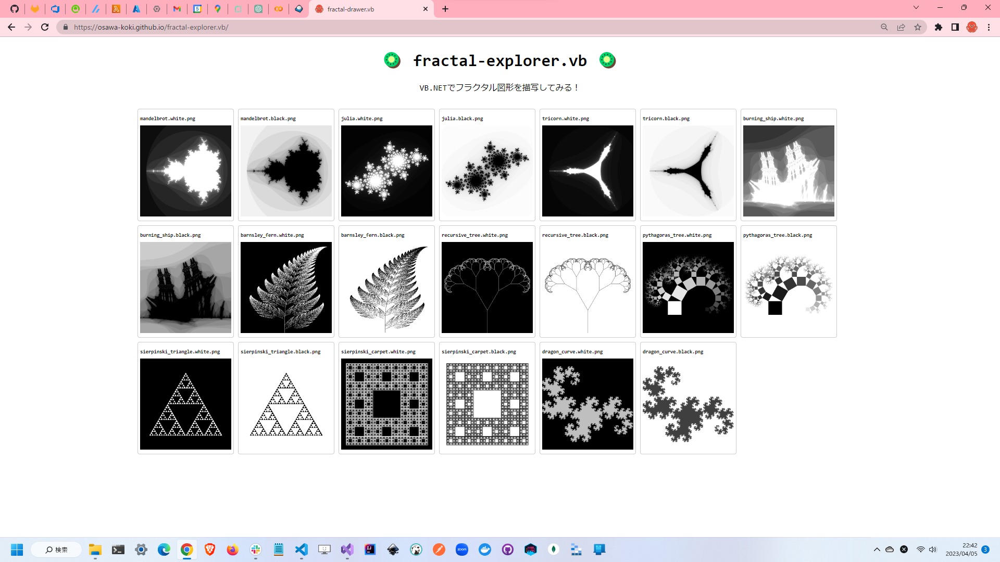

# fractal-explorer.vb

🥝🥝🥝 VB.NET(Visual Basic)でフラクタル図形を描写してみる！  

  

## 実行方法

`Visual Studio`で実行すればOKです。  
コマンドラインから実行する場合は、以下の手順で実行できます。  

---

最初に`MSBuild`のパスを通します。  
`C:\Windows\Microsoft.NET\Framework\v*****\`にある`MSBuild.exe`のパスを通します。  

次に以下のコマンドでコンパイルを行います。  

```shell
msbuild /t:Build /p:Configuration=Release ./src/Program.vbproj
```

生成された実行可能プログラムを実行します。  

```shell
./src/bin/Release/fractal-explorer.exe
```
